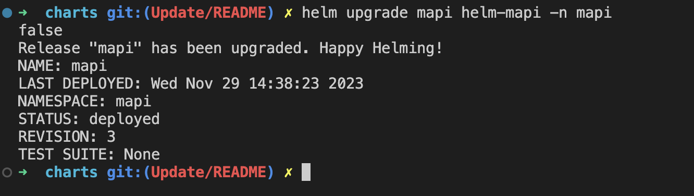

# Helm Charts Repository

This repository contains Helm charts for deploying Weather Application on a Kubernetes cluster.

## Table of Contents

- [Overview](#overview)
- [Prerequisites](#prerequisites)
- [Installation](#installation)
- [Upgrading](#upgrading)
- [Uninstallation](#uninstallation)

# Overview

This repository is having HELM charts for the application stack (front-end + back-end) APIs.

# Prerequisites

Necessary prerequisites that users need to have before deploying the Helm charts.
1. Kubernetes
2. Docker 
3. Helm

# Installation

Start installing helm charts
```
$ cd charts

```
Create a namespace for ingress controller
```
$ kubectl create namespace ingress-controller

```

Installing Ingres controller form the official (public) [helm repo](https://artifacthub.io/packages/helm/bitnami/nginx-ingress-controller)
```
$ helm install controller ingress-nginx/ingress-nginx -n ingress-controller

```
Installing the application stack

```
$ helm install mapi helm-mapi -n mapi && 
helm install wapi helm-wapi -n wapi && 
helm install webapp helm-webapp -n webapp
```

### Endpoints for application
Click on following URL to launch the webapp application
Local environment : http://localhost:30002

# Upgrading

To upgrade any specific helm chart you can change your directory to that specific chart's directory.
#### For example mapi
```
$ cd charts/helm-mapi
```
and open values.yaml file with any of your favorite code editor
and you'll be having all the parameters such as [replicaCount, imageTag, env, etc...] to change/upgrade according to your requirements.
### Image tag in this case


### commands to update
```commandline
$ helm upgrade mapi helm-mapi -n mapi
```


Chart version is being upgraded from version:`0.1.5` to `0.1.6`


# Uninstallation
To uninstall all the charts together you can use following commands
```commandline
$ helm uninstall mapi -n mapi &&
helm uninstall wapi -n wapi &&
helm uninstall webapp -n webapp &&
helm uninstall controller -n ingress-controller
```
another way to uninstall any specific chart
for mapi in this case:
```commandline
$ helm uninstall mapi -n mapi
```


##### *Happy helming..!*